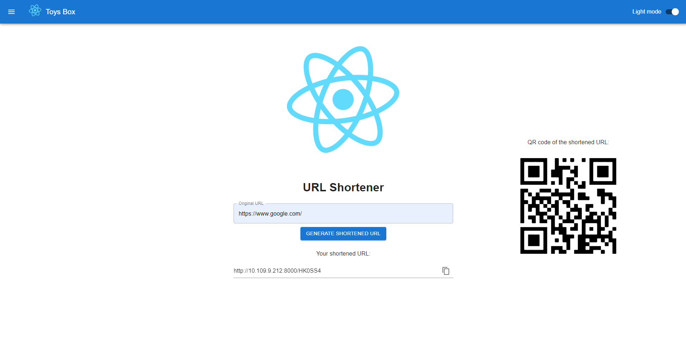
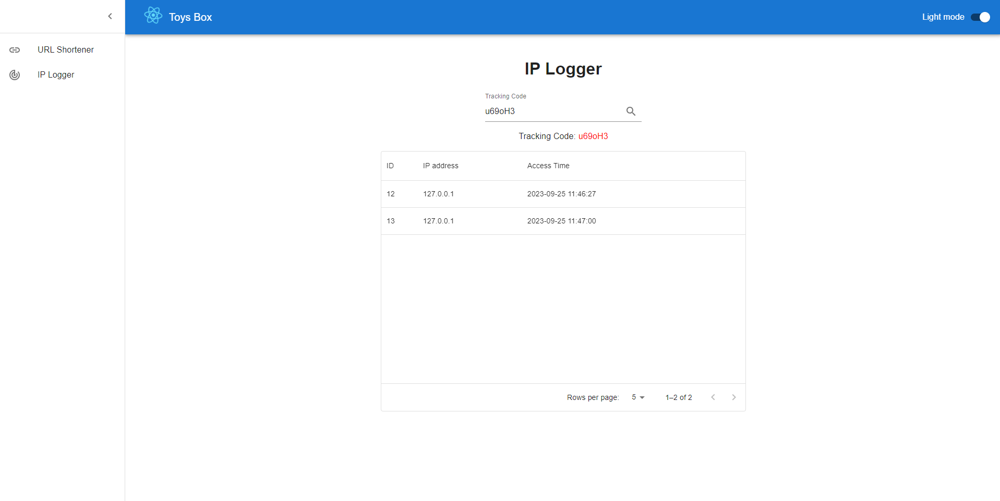
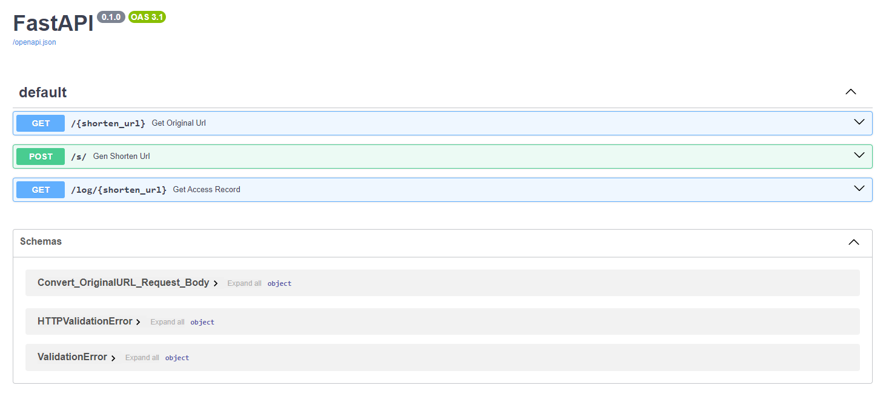

# URL Shortener
This is a project that consists of a front-end built with React.js, a back-end built with FastAPI, and a MySQL database.

## Screenshot

URL Shortener UI: 


IP Logger UI:


API docs:


## Getting Started
To get started with this project, follow these steps:

### Prerequisites
Before you can run the front-end and back-end servers, you need to have the following software installed on your machine:

- Node.js
- npm
- Python 3
- pip
- MySQL

### Installing
To install the project dependencies, run the following command in `URL_Shortener/frontend/url-shortener/`:

```
npm install
```

This will install all the necessary dependencies for the front-end server.

To install the back-end dependencies, run the following command in `URL_Shortener/backend/`:

```
pip install -r requirements.txt
```

This will install all the necessary dependencies for the back-end server.

### Configuration

#### Configuration of Front-end
Before you can start the servers, you need to set the API URL and port in the `.env` file. Follow these steps to set up the API URL and port:

1. Open the `.env` file in the `URL_Shortener/frontend/url-shortener/` directory.

2. Update the `REACT_APP_API_URL` and `REACT_APP_API_PORT` fields with the correct API URL and port. For example:

```
REACT_APP_API_URL=127.0.0.1
REACT_APP_API_PORT=8000
```

Replace `127.0.0.1` with the IP address or domain name of your server, and `8000` with the port number that the back-end server will be running on.

#### Setting up the Database
To set up the database, follow these steps:

1. Run the following command to start up the MySQL server:

```
mysqld.exe --console
```

2. Log in to MySQL using the command line or a MySQL client.

3. Create a new database for the URL Shortener application:

```
CREATE DATABASE url_shortener;
```

4. Import the `data.sql` file to create the necessary tables and data:

```
USE url_shortener;
SOURCE URL_Shortener/backend/data.sql;
```
This will create the necessary tables and data for the application.

#### Configuration of Back-end
Before you can start the back-end server, you need to set up the database connection in `database.py`. Follow these steps to set up the database connection:

1. Open the `database.py` file in the `URL_Shortener/backend/` directory.

2. Update the `SQLALCHEMY_DATABASE_URL` field with the correct database connection information. For example:

```
SQLALCHEMY_DATABASE_URL = "mysql+pymysql://root:<password>@localhost:3306/url_mapping_db"
```

Replace `<password>` with the password for the root user.

3. Save the database.py file.

### Starting the Servers

To start the front-end server, run the following command in `URL_Shortener/frontend/url-shortener/` of the project:

```
npm start
```

This will start the front-end server on port 3000.

To start the back-end server, run the following command in `URL_Shortener/backend/`:

```
uvicorn main:app --host 0.0.0.0 --reload
```

This will start the back-end server on port 8000.

### Accessing the Application
Once the servers are running, you can access the application by opening a web browser and navigating to http://localhost:3000. This will display the front-end of the application.

The back-end API can be accessed by sending HTTP requests to http://localhost:8000. The API documentation can be found in the http://localhost:8000/docs.

## Built With
- React.js
- FastAPI
- MySQL

## Authors
- Oscar Ng

## License
This project is licensed under the MIT License - see the LICENSE file for details.
